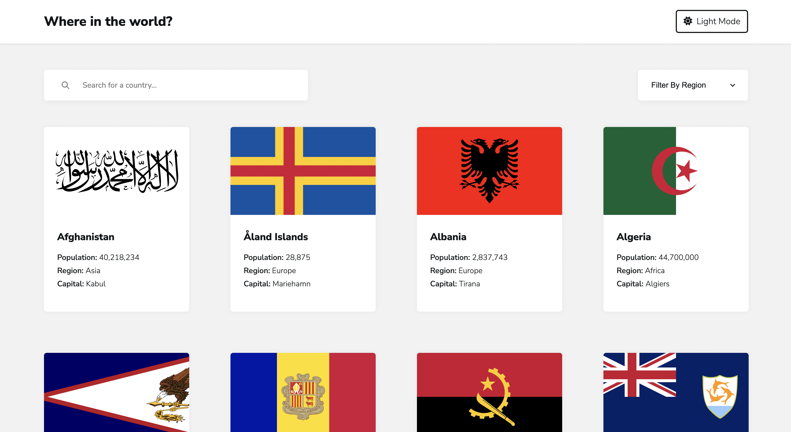

# rest-countries-api

This app pulls data from the REST Countries API to display information about various countries in the world. Clicking a card will lead to a separate page which displays more detailed information about the corresponding country.

## Demo
[Live Demo](https://nc-rest-countries-api.netlify.app/)

## Built with
- CSS Flexbox & Grid
- React
- React Router v6
- Vite
- [REST Countries API](https://restcountries.com/)

## Features
- See all countries from the API on the homepage
- Search for a country using an input field
- Filter countries by region (Africa, Americas, Asian, Europe and Oceania)
- Click on a country to see more detailed information on a separate page
- Click through to the border countries on the detail page
- Toggle the color scheme between light and dark mode

## Lessons Learned
This was one of my very first projects using React Router v6. I learned about the many components and hooks it comes with that allow us to conditionally render large parts of our pages. I also learned about ContextApi for state management, I moved all my useState() hooks and functions to the Context.js file which helped me avoid props drilling and kept my codebase more clean and organized.
